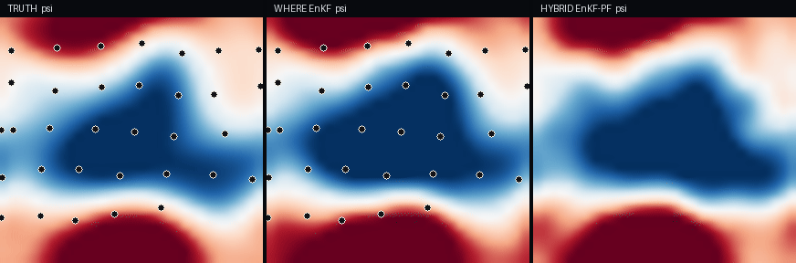

# QG Lagrangian DA lab

Interactive reconstruction of a barotropic quasi-geostrophic streamfunction from sparse Lagrangian drifters.

Public companion to:

> Droobi, A. (2025). *Data-driven filtering techniques for turbulent flow models (a Lagrangian data assimilation approach)*. Master's thesis, University of Calgary. [Scholaris](https://ucalgary.scholaris.ca/items/b4a3d3b9-4fbf-4d1e-8e1e-80c71c009825)

**Live:** [qg-lada-lab.netlify.app](https://qg-lada-lab.netlify.app) · [Simulate](https://qg-lada-lab.netlify.app/simulate)




The browser lab runs a spectral QG twin and a localized stochastic EnKF (WHERE, thesis Algorithm 5), with an optional hybrid EnKF–PF branch (Algorithms 8–9). Dynamics terms and filter knobs are live.

```
∂q/∂t + J(ψ, q) + β ∂ψ/∂x = F − d q − ν (−∇²)ᵖ q
q = ∇²ψ − μψ
ψ̂ = −q̂ / (κ² + μ)
```

```
Lagrangian drifters (partial, noisy velocity)
        ↓
  Spectral QG twin  (truth + forecast ensemble)
        ↓
  Helmholtz inversion  ψ̂ = −q̂ / (κ² + μ)
        ↓
  Localized stochastic EnKF  (Gaspari–Cohn, inflation)
        ↓  optional
  Hybrid EnKF–PF branch
        ↓
  Reconstructed Eulerian field → spectra, XCOR
```

## What is real

| Piece | Status |
| --- | --- |
| Spectral QG operators in the browser lab | Implemented |
| Localized EnKF (WHERE / Algorithm 5) | Implemented |
| Hybrid EnKF–PF (Algorithms 8–9) | Implemented, optional |
| Python solver `research/qg_lada.py` | Committed |
| Reported XCOR | **0.964** mean on the committed N = 32 identical-twin run (`research/metrics_summary.json`). Demo scale. Not a production forecast score. Thesis Table 10.1 used a different resolution and horizon. |
| MATLAB working copy | [`local_wccm`](https://github.com/ahmaddroobi99/local_wccm) |
| MATLAB trees `SWE_LaDA`, `QGcode_first_year` | Linked from older notes; those GitHub paths 404 |

Helmholtz inversion follows `baro.ipynb` (`ψ̂ = −q̂/(κ²+μ)`), not the unsigned formula typeset in Algorithm 5.

## Run the Python experiment

```bash
pip install -r research/requirements.txt
python research/qg_lada.py
```

Committed run (from `research/metrics_summary.json`): N = 32, Ne = 24, 40 tracers, tend = 28. WHERE mean XCOR 0.964, free-run mean XCOR 0.316.

Private research codes stay in [`QG_work`](https://github.com/ahmaddroobi99/QG_work) (private).

## Filter knobs

Ensemble size, Gaspari–Cohn radius, observation noise, inflation, analysis interval, stochastic vs deterministic EnKF, hybrid branch on/off, and each PDE term (Jacobian, β, forcing, damping, hyperviscosity).

## Stack

TypeScript / React lab (TanStack Start). Python numerical experiment. Spectral QG + EnKF — same family of methods as the thesis.

## Related

- MATLAB filter: [local_wccm](https://github.com/ahmaddroobi99/local_wccm)
- Thesis: [Scholaris](https://ucalgary.scholaris.ca/items/b4a3d3b9-4fbf-4d1e-8e1e-80c71c009825)
- Profile: [github.com/ahmaddroobi99](https://github.com/ahmaddroobi99)

## License

Original lab code in this repository. Thesis text and figures remain under University of Calgary deposit terms.
