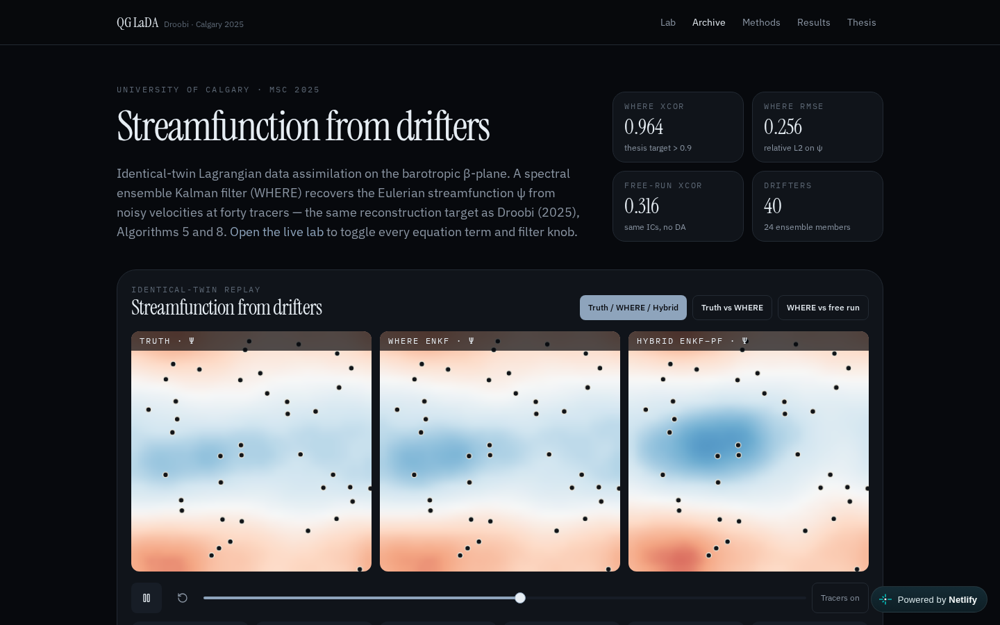

# QG Lagrangian DA lab

Interactive reconstruction of a barotropic quasi-geostrophic streamfunction from Lagrangian drifters.

This is the public, runnable companion to my MSc thesis at the University of Calgary:

> Droobi, A. (2025). *Data-driven filtering techniques for turbulent flow models (a Lagrangian data assimilation approach)*. Master's thesis, University of Calgary. [Scholaris](https://ucalgary.scholaris.ca/items/b4a3d3b9-4fbf-4d1e-8e1e-80c71c009825)

**Live lab:** [qg-lada-lab.netlify.app](https://qg-lada-lab.netlify.app) · [Simulate](https://qg-lada-lab.netlify.app/simulate)



The browser **Lab** runs a spectral quasi-geostrophic twin and a localized stochastic EnKF (WHERE, thesis Algorithm 5) with an optional hybrid EnKF–PF branch (Algorithms 8–9). Every term in the dynamics can be switched off, and every filter knob is live.

```
∂q/∂t + J(ψ, q) + β ∂ψ/∂x = F − d q − ν (−∇²)ᵖ q
q = ∇²ψ − μψ
ψ̂ = −q̂ / (κ² + μ)
```

```
Lagrangian drifters (partial, noisy velocity)
        ↓
  Spectral QG twin  (truth + forecast ensemble)
        ↓
  Helmholtz inversion  ψ̂ = −q̂ / (κ² + μ)
        ↓
  Localized stochastic EnKF  (Gaspari–Cohn, inflation)
        ↓  optional
  Hybrid EnKF–PF branch
        ↓
  Reconstructed Eulerian field → spectra, XCOR, visualization
```

## What is real

| Piece | Status |
|---|---|
| Spectral QG operators in the browser lab | Implemented |
| Localized EnKF (WHERE / Algorithm 5) | Implemented |
| Hybrid EnKF–PF (Algorithms 8–9) | Implemented, optional |
| Python solver `research/qg_lada.py` | Committed, N = 32 run |
| Reported XCOR | **0.964** on the committed N = 32 Python run — not a production forecast score |
| MATLAB trees `SWE_LaDA`, `QGcode_first_year` | Linked from the thesis notes; those GitHub paths 404 |

Helmholtz inversion follows `baro.ipynb` (`ψ̂ = −q̂/(κ²+μ)`), not the unsigned formula typeset in Algorithm 5.

## Run the Python experiment

```bash
pip install -r research/requirements.txt
python research/qg_lada.py
```

The Python solver uses the same operators as the lab. Private research codes live in [`QG_work`](https://github.com/ahmaddroobi99/QG_work) (private).

## Filter knobs (live in the lab)

- Ensemble size `N_e`
- Localization length `L` / Gaspari–Cohn radius
- Observation noise `σ_o`
- Inflation
- Analysis interval
- Stochastic vs deterministic EnKF
- Hybrid EnKF–PF branch on/off
- Each PDE term (Jacobian, β, forcing, damping, hyperviscosity) can be disabled

## Stack

- TypeScript / React lab (TanStack Start) for interactive inspection
- Python numerical experiment for the committed reconstruction
- Spectral QG + EnKF — the same family of methods as the thesis

## Related

- Thesis (PDF): [Scholaris](https://ucalgary.scholaris.ca/items/b4a3d3b9-4fbf-4d1e-8e1e-80c71c009825)
- LinkedIn: [linkedin.com/in/droobi7](https://www.linkedin.com/in/droobi7/)
- Profile: [github.com/ahmaddroobi99](https://github.com/ahmaddroobi99)

## License

Original lab code in this repository. Thesis text and figures remain under University of Calgary deposit terms.

---

Account grouping: research first, undergraduate last — see the [profile README](https://github.com/ahmaddroobi99/ahmaddroobi99). GitHub cannot custom-sort the Repositories tab.

